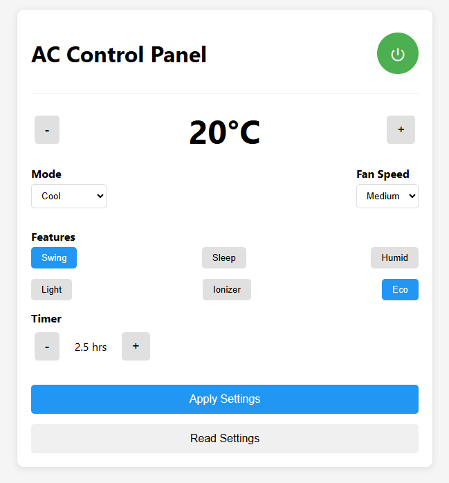

#  Reverse engineered `SAC9010QC` / `SAC12010QC` IR protocol

Reverse engineered IR protocol for HomeFit Living / Alaska `SAC9010QC` / `SAC12010QC` remote control based on an `NEC 756504012` IC. It is [apparently](https://aliexpress.com/wholesale?SearchText=Gree+Y512) also known as the "`Gree Y502 / Y512`" remote and the silkscreen on the PCB states "`Gree 5I2`".

If you want to go straight to the juicy parts, go checkout [protocol.md](protocol.md).

The [documentation](documentation) directory contains the `SAC9010QC` / `SAC12010QC` manual and other resources used. The [pics](pics) directory contains some photos of the remote control, it's PCB and my test setup. [dumps](dumps) contains a few [PulseView](https://sigrok.org/wiki/PulseView) dumps of the IR signal as captured by my [DSLogic Plus](https://aliexpress.com/item/33023055743.html).

Finally, [src](src) contains a simple webserver that can be used to control the AC unit by using a REST protocol. It uses the WiFiManager for initial WiFi setup (connect to it's accesspoint, enter your WiFi SSID and password) and after that you can go to it's IP and do a `GET` on `/state` to get the current state (as managed by the ESP, not the _actual_ state of the AC unit, since that cannot be read). The response will look like:

```json
{
    "power": false,
    "temperature": 20,
    "fanspeed": 0,
    "mode": "COOL",
    "swing": false,
    "sleep": false,
    "humid": false,
    "light": false,
    "ionizer": false,
    "save": false,
    "timer": 0,
    "rssi": -62,
    "devicename": "AC Remote Control"
}
```

The same JSON can be used to send a new state to the AC unit. Use the same `/state` endpoint and use the `PUT` method. The modes are: `AUTO`, `COOL`, `DEHUMIDIFY`, `FAN` and `HEAT` and are case-insensitive. Fanspeed `0` is `Auto` and can be `0` to `3`. Temperature can range from `16` to `30`. The timer is specified in half-hour increments and can range from `0` to `48` (24 hours). So if you want to set a timer for 13.5 hours use the value `27` (`13.5hr / 0.5hr increments = 27`). The `air1` and `air2` values (see [protocol](protocol.md), bits 24 and 25) are currently not exposed over REST. The webserver uses [IRremoteESP8266](https://github.com/crankyoldgit/IRremoteESP8266) for sending the IR commands (using the [Teco](https://github.com/crankyoldgit/IRremoteESP8266/blob/master/SupportedProtocols.md) protocol).

This is the actual remote:


## Hardware

This works with any(?) Arduino compatible MCU like an ESP8266 (Wemos D1 Mini for example) or ESP32. Below are two setups I tested.

### ESP8266 IR board

Recently I discovered these boards (labeled `ESP_IR_TR_WIFI`) on AliExpress:


They appear to be an IR "repeater". Signals received will be broadcast over UDP to another module and be broadcasted as IR by the receiving module, in effect creating some sort of "repeater" or "extender".

You can find them here: [seller 1](https://aliexpress.com/item/1005006489153990.html), [seller 2](https://aliexpress.com/item/1005006782835490.html), [seller 3](https://aliexpress.com/item/1005006755657799.html), [seller 4](https://aliexpress.com/item/1005006794617042.html), [seller 5](https://aliexpress.com/item/1005006778208154.html), [seller 6](https://aliexpress.com/item/1005007181003707.html), [seller 7](https://aliexpress.com/item/1005007560761004.html), ...

These are cheap and work great for this application and require no soldering. You'll only need **one** of these boards. The IR LED is connected to `GPIO4`, as is the [default](blob/c1bd01e1315854d54fd1c1d8cddc4628a7dbf262/src/main.cpp#L11). All you need to do is connect a [USB to Serial](https://aliexpress.com/w/wholesale-usb-to-uart.html) adapter to it and flash the firmware. The USB-C port is for **power only** unfortunately. To flash the module, [ground `GPIO0`](pics/esp-12f.jpg) and then power the board, flash the firmware and after that you can disconnect the wire from `GND` to `GPIO0`.

### Wemos D1 mini

In the [circuit](circuit) directory you can find a circuit for a Wemos D1 Mini. You'll need:

-   1 resistor 100Ω
-   1 resistor 680Ω
-   1 2N3904 NPN BJT
-   1 IR LED
-   A bit of solder and a soldering iron (and soldering skills)
-   Optionally some wire / perfboard to mount the components (but you can [deadbug](https://en.wikipedia.org/wiki/Point-to-point_construction#%22Dead_bug%22_construction) the circuit like [this](circuit/wemos2.jpg))

Build the circuit, flash the Wemos D1 module and you're done.

## Web interface

This project offers a web UI. We already mentioned the `/state` [`GET`] REST endpoint but when you go to http://<deviceip>/ you will be greeted with this:



This makes your remote totally redundant. Other endpoints of interest are `/mac` [`GET`] (returns the MAC-address of the device) and `/reset` [`PUT`] (reboots the device). Keep in mind that there is no such thing as 'two way communication', there is _no_ way to get the actual state of the AC. So this 'controller' keeps a state and whenever changes are applied, _all_ values are sent to the AC to ensure all values are applied. However, when you change the AC with your remote then this controller has no way of knowing what values, if any, changed or what the current values are. It will still 'think' the AC is in the state it last sent to the AC. But you'll be happy to know that this 'web app' can be added to your phone's homescreen and you can put your remote in a drawer (tip: remove batteries first!). The "Read settings" does nothing more than retrieve the AC state from the controller (what _it 'thinks'_ state the AC is in) and sync the UI with those values.

---

## Attribution

Icon by [Wishforge.games](https://www.wishforge.games/?ref=svgrepo.com) at [SVG Repo](https://www.svgrepo.com/svg/390814/winter-snow-flake-cold-season-christmas)
